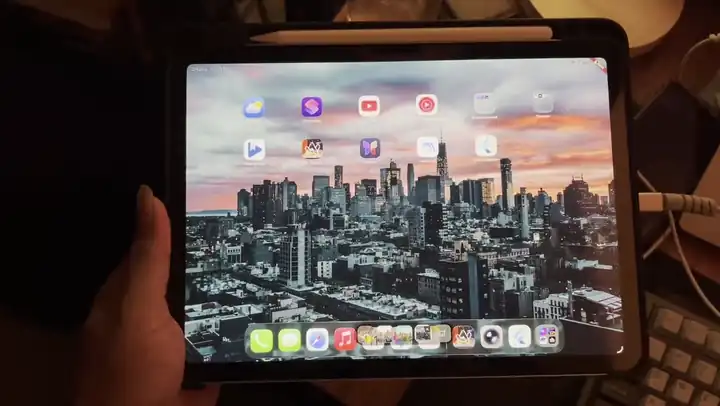

# duo_animation

**Any widget, any UI. Wrap it and it folds.**

Tilt the device and the wrapped subtree lifts away from a hinge, sliding behind
frosted glass. A fragment shader over a rasterized layer, driven by the
gyroscope.

[](assets/demo.mp4)

> **Impeller only.** Built on `ui.ImageFilter.shader`, which no other backend
> has. Elsewhere it throws `DuoFoldUnsupportedError` rather than silently
> rendering the child unfiltered. Android and iOS ship Impeller; web and desktop
> do not.

## Install

```yaml
dependencies:
  duo_animation: ^0.1.0
```

## Use

Start a controller, wrap your widget, dispose it.

```dart
class _MyPageState extends State<MyPage> {
  final controller = DuoFoldController();

  @override
  void initState() {
    super.initState();
    controller.start();
  }

  @override
  void dispose() {
    controller.dispose();
    super.dispose();
  }

  @override
  Widget build(BuildContext context) {
    return DuoFoldMotion(controller: controller, child: const MyContent());
  }
}
```

`start()` subscribes to the sensor, or falls back to manual mode if the device
has none. Calling it twice does nothing. Each sample rebuilds the filter only,
never `child`.

## Without the sensor

`DuoFold` takes the tilt directly, from an animation, a slider, a drag.

```dart
DuoFold(
  tiltDegrees: 20,
  liftDirection: const Offset(-1, 0), // hinge right, frost spreading left
  child: const MyContent(),
)
```

`liftDirection` is a unit vector in fragment coordinates (y down) pointing from
the hinge toward the edge that lifts. Below `DuoFold.tiltEpsilon` the child
renders directly, skipping the layer and the shader, so leaving it mounted at
rest is free.

Or drive the controller by hand, which is what a simulator does:

```dart
final controller = DuoFoldController()..manualTiltDegrees = 20;
```

## Hinges

The default is a left or right hinge. Nothing folds toward the reader unless you
ask, since that axis moves every time a phone is picked up.

```dart
DuoFoldConstraints.horizontal()  // default: left, right
DuoFoldConstraints.vertical()    // top, bottom
DuoFoldConstraints.free()        // follow the lean
DuoFoldConstraints.only(DuoFoldHinge.right, maxTiltDegrees: 25)
DuoFoldConstraints.allow({DuoFoldHinge.left, DuoFoldHinge.top})
```

Each takes a `maxTiltDegrees` ceiling, default 45. Constraints apply before the
tilt is published, so the effect and any readout agree, and swapping them at
runtime needs no recalibration.

## Tuning

`DuoFoldParameters` is a physical model, tuned by default for a phone at arm's
length.

| Parameter | Default | Effect |
| --- | --- | --- |
| `blurSpread` | `0.12` | Blur per pixel of separation from the content, so frost thickens away from the hinge |
| `baseBlurMillimeters` | `0.10` | Even frost across the pane. Without it the hinge line stays razor sharp, which is correct optics but wrong for glass |
| `darkening` | `0.0084` | Light lost per pixel of blur. Frostier glass reads closer to `hazeColor` |
| `tiltResponse` | `1` | Exponent on tilt. Above 1 starts gently and arrives late; below 1 front-loads. Try 2 on a tablet |
| `stretchEdges` | `true` | Where the glass passes the content edge: smear the edge row, or show `surroundColor` |
| `eyeDistanceMillimeters` | `450` | Viewing distance, which sets the perspective. 320 is dramatic, 450 calm |
| `surroundColor` | black | What lies past the content edge. Black is a void; your background makes the fold sit on the surface |
| `hazeColor` | black | What scattered light fades toward. Black absorbs, white veils |

`baseBlurMillimeters` is in millimetres of physical screen, so the frost holds
its size across densities. The controller reads density from the platform,
falling back to `DuoFoldParameters.fallbackPixelsPerMillimeter`.

## Testing

`manualTiltDegrees` covers most cases. To exercise the motion filter itself,
`FakeMotionSource` takes scripted poses:

```dart
final source = FakeMotionSource();
final controller = DuoFoldController(source: source);
await controller.start();
source.emit(
  const MotionSample(
    screenMatrix: <double>[1, 0, 0, 0, 1, 0, 0, 0, 1], // row-major, at rest
    omegaScreenY: 0,
    omegaScreenX: 0,
    omegaMagnitude: 0,
    hasGyro: true,
    timestampSeconds: 0,
  ),
);
```

`screenMatrix` columns are screen-right, screen-up, screen-normal. Tilted poses
are tedious to write, so prefer `manualTiltDegrees` unless you are testing the
filter's arithmetic.

## Platforms

| | Minimum | Needs |
| --- | --- | --- |
| Android | API 24 | Impeller, rotation vector sensor |
| iOS | 13.0 | Impeller, Core Motion |

Attitude comes from a reference frame without the magnetometer, so a passing
magnet cannot shift the pose. Calibration, prediction, smoothing and drift
washout all run in Dart.

## Limits

The child is rasterized before the shader runs, so it must be Flutter-drawn.
Platform views and texture widgets will not fold.

`DuoFoldUnsupportedError`: the renderer is not Impeller.
`DuoFoldShaderError`: the shader failed to load or compile, with `cause` set.

## Example

`example/` is one file. It has no platform folders, so run
`flutter create --platforms=android,ios .` there first.

The [playground](https://github.com/narayann7/duo_animation_playground) is the
one to actually tune against: every parameter on screen, all constraint modes,
folding real screens.

## License

MIT
